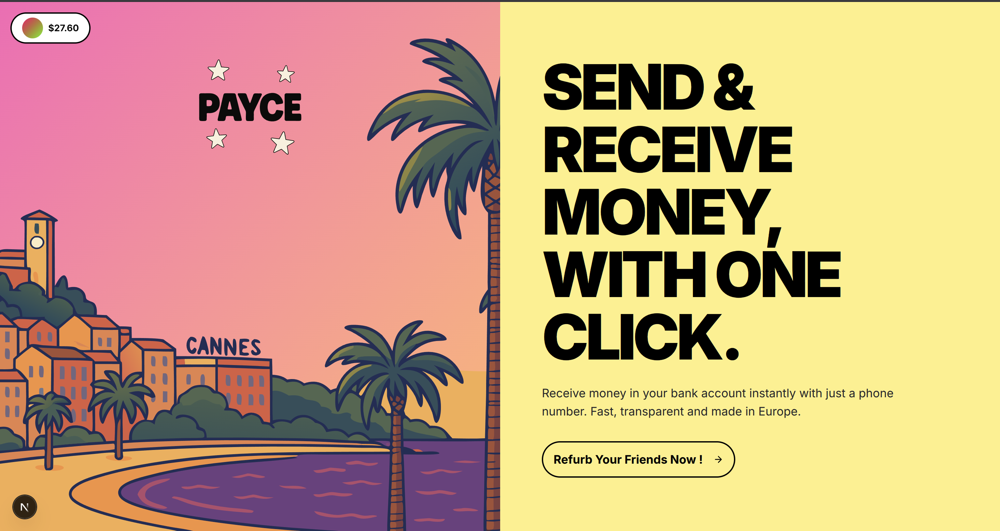

# Beam ⚡

**Send crypto to anyone, anywhere, with just an email address.**

<div align="center">
  
</div>

---

<div align="center">

[](https://beam-app.vercel.app/)
[](https://docs.beam-app.com)

</div>

## 🎯 What is Beam?

Beam makes sending crypto as intuitive as sending an email. No more complex wallet addresses or gas fee worries. Simply use an email address to send USDC on the Avalanche network. Recipients get a secure, self-custody wallet created instantly via **Privy**, and can claim funds without needing native tokens for gas.

## ✨ Core Features

- **📧 Email-Based Transfers**: Send crypto using email addresses instead of complex `0x...` addresses
- **⛽ Gas-Free Claims**: Recipients don't need AVAX tokens to claim their funds
- **🔗 Multi-Channel Sharing**: Share claim links via email, WhatsApp, Twitter, or direct copy
- **🔐 Instant Wallets by Privy**: Secure, non-custodial wallets created automatically
- **🚀 Fast & Affordable**: Built on **Avalanche** for quick, low-cost transactions
- **🛡️ Secure Authentication**: Email-based login ensures only the intended recipient can claim funds

---

## 🏗️ Architecture Overview

### The "Sponsor Wallet" Pattern

Beam solves the classic "gas problem" for crypto newcomers through our innovative **Sponsor Wallet** architecture:

1. **Central Sponsor Wallet**: A pre-funded wallet that holds AVAX (for gas) and USDC reserves
2. **Simplified Sender Flow**: Senders only need to send USDC to the Sponsor Wallet in one transaction  
3. **Backend Gas Sponsorship**: Our backend uses the Sponsor Wallet to pay gas fees for recipient claims
4. **Gas-Free Experience**: Recipients claim funds without needing any native tokens

This creates a seamless experience where senders make one simple transaction and recipients claim funds with zero blockchain complexity.

---

## 🔄 User Flows

### 👤 Sender Flow

1. **Connect Wallet**: Use Privy to connect your existing wallet (MetaMask, WalletConnect, etc.)
2. **Enter Transfer Details**: Input recipient's email address and USDC amount
3. **Choose Sharing Method**: Select how to deliver the claim link:
   - 📧 **Email** (default, secure delivery)
   - 📱 **WhatsApp** sharing
   - 🐦 **Twitter/Social** sharing
   - 🔗 **Copy Link** (manual sharing)
4. **Send Funds**: One transaction sends USDC to the Sponsor Wallet
5. **Automatic Delivery**: System generates claim link and delivers via chosen method

### 👥 Recipient Flow

1. **Receive Claim Link**: Get the link via email, WhatsApp, social media, or direct share
2. **Open Claim Page**: Click link to view transfer details and amount
3. **Login with Email**: Use Privy to authenticate with the email address sender specified
4. **Automatic Wallet Creation**: If new to crypto, Privy creates a secure embedded wallet instantly
5. **Claim Funds**: One-click claim process with backend handling all gas fees
6. **Receive USDC**: Funds appear in your Privy wallet, ready to use

---

## 🛠️ Technical Stack

- **Framework**: Next.js 15 with TypeScript
- **Styling**: Tailwind CSS with shadcn/ui components  
- **Blockchain**: Avalanche C-Chain
- **Web3 Libraries**: `viem` & `wagmi` for blockchain interactions
- **Authentication**: **Privy** for email-based login and embedded wallets
- **Database**: Supabase for transfer data and claim management
- **Notifications**: Email delivery for claim links and updates

---

## 🔧 Smart Contract Integration

Beam utilizes a custom smart contract deployed on Avalanche that handles:

- **Transfer Creation**: Secure transfer records with claim hashes
- **Sponsor Management**: Automated sponsor wallet funding and claims
- **Security Features**: ReentrancyGuard, Pausable, and Ownable patterns
- **Emergency Controls**: Owner functions for pause/unpause and emergency withdrawals

**Contract Address**: `0x7ac3a7E943015Fe81D23701f3fb1D01072446070`  
**Network**: Avalanche Fuji Testnet  
**Explorer**: [View on Snowtrace](https://testnet.snowtrace.io/address/0x7ac3a7E943015Fe81D23701f3fb1D01072446070)

### Smart Contract Features

The deployed Beam contract includes:

1. **Transfer Creation**: Users can create transfers with claim hashes
2. **Direct Claims**: Recipients can claim their transfers directly
3. **Sponsor System**: Sponsors can deposit funds and claim on behalf of users
4. **Security**: ReentrancyGuard, Pausable, and Ownable patterns
5. **Emergency Functions**: Owner can pause/unpause and emergency withdraw

---

## 🎯 User Stories & Use Cases

### Story 1: First-Time Crypto Sender
**As a** crypto user with USDC  
**I want to** send crypto to my friend who has never used crypto before  
**So that** I can share money easily without explaining complex wallet setups

**Flow**: Connect wallet → Enter email → Select sharing method → Send USDC

### Story 2: Crypto Newcomer Recipient
**As a** person who has never used crypto  
**I want to** claim funds sent to me  
**So that** I can receive money without learning about wallets or gas fees

**Flow**: Click claim link → Login with email → Auto-claim funds

### Story 3: Social Media Sharing
**As a** content creator or social media user  
**I want to** share crypto payments publicly or via social platforms  
**So that** I can tip followers or share money in creative ways

**Flow**: Choose sharing method → Generate links → Share across platforms

### Story 4: Business Payment Flow
**As a** business owner  
**I want to** send payments to employees or contractors  
**So that** I can pay people quickly without knowing their wallet details

**Flow**: Sequential payments → Unique claim links → Professional notifications

### Story 5: Cross-Platform Compatibility
**As a** mobile user  
**I want to** send and receive payments on my phone  
**So that** I can use Beam on any device seamlessly

**Flow**: Responsive design → Mobile wallet support → Touch-friendly UI

---

## 🚀 Getting Started

### Prerequisites
- Node.js 18+ and npm/pnpm
- Avalanche wallet with AVAX and USDC for testing
- Supabase account for database
- Privy account for authentication

### Installation

1. **Clone the repository**
   ```bash
   git clone https://github.com/your-org/beam-app.git
   cd beam-app
   ```

2. **Install dependencies**
   ```bash
   npm install
   # or
   pnpm install
   ```

3. **Environment setup**
   ```bash
   cp .env.example .env
   # Fill in your Avalanche, Supabase, and Privy configuration
   ```

4. **Start development server**
   ```bash
   npm run dev
   ```

### Available Scripts

```bash
# Development
npm run dev          # Start development server
npm run build        # Production build
npm start           # Start production server

# Smart contract operations
npm run compile     # Compile contracts
npm run deploy:fuji # Deploy to Avalanche Fuji testnet
npm run fund-sponsor:fuji # Fund sponsor wallet
npm run verify:fuji # Verify contract on Snowtrace
npm run test:contracts # Run contract tests

# Code quality
npm run lint        # Run ESLint
```

---

## 🌐 Network Details

- **Network**: Avalanche Fuji Testnet
- **Chain ID**: 43113
- **Currency**: AVAX (testnet)
- **USDC Token**: `0x5425890298aed601595a70AB815c96711a31Bc65`
- **Beam Contract**: `0x7ac3a7E943015Fe81D23701f3fb1D01072446070`
- **Explorer**: https://testnet.snowtrace.io

---

## 💰 Funding Instructions

To use the application, the sponsor wallet needs USDC funds:

1. Get AVAX testnet tokens from [Avalanche Faucet](https://faucet.avax.network/)
2. Get USDC tokens from [Chainlink Faucet](https://faucets.chain.link/avalanche-fuji)
3. Run funding script: `npm run fund-sponsor:fuji`

---

## 🔌 API Reference

### Transfer Creation
```typescript
POST /api/create-transfer
{
  "senderAddress": "0x742d35Cc6e6c19a4a4eF8a4F5A8C8E6f3F4F7D8E",
  "recipientEmail": "alice@example.com", 
  "amount": "50.0",
  "txHash": "0xabc123def456...",
  "sharingMethod": "email"
}
```

### Claim Execution  
```typescript
POST /api/execute-claim
{
  "claimHash": "abc123...",
  "recipientAddress": "0x..."
}
```

---

## 🛡️ Security & Trust

- **Email-Based Security**: Only the specified email holder can claim funds
- **Non-Custodial Wallets**: Users maintain full control of their private keys through Privy
- **Audited Smart Contract**: Contract follows OpenZeppelin security standards
- **Secure Backend**: Server-side validation and email authentication for all claims
- **Multi-Channel Flexibility**: Claim links work regardless of sharing method, but email authentication is required

---

## 📊 Production Readiness Status

### ✅ Completed
- **Smart Contract**: Deployed on Avalanche Fuji testnet and production-ready
- **API Endpoints**: All transformed and tested
- **User Flows**: Email-based authentication with multi-channel sharing implemented
- **Code Quality**: Zero lint errors, successful build, type-safe TypeScript
- **Frontend**: Responsive, cross-browser compatible
- **Security**: Multi-layer authentication and validation

### 🔧 Smart Contract Features
- **Transfer Creation**: Secure transfer records with claim hashes
- **Sponsor Management**: Automated sponsor wallet funding and claims
- **Security Features**: ReentrancyGuard, Pausable, and Ownable patterns
- **Emergency Controls**: Owner functions for pause/unpause and emergency withdrawals

### 🎨 Frontend Features
- **SendCard**: Email input + sharing method selector
- **SharingMethodSelect**: 4 sharing options (email, WhatsApp, Twitter, copy)
- **Claim Page**: Direct claim after email authentication
- **Multi-Channel Sharing**: Email, WhatsApp, Twitter, and copy link support

---

## 🧪 Testing & Validation

### Code Quality Tests
- **ESLint**: ✅ No warnings or errors
- **TypeScript**: ✅ All types properly defined  
- **Build Process**: ✅ Production build successful
- **Dependencies**: ✅ All packages up to date

### Smart Contract Tests
- **Compilation**: ✅ Contract compiles without errors
- **ABI Generation**: ✅ Updated for Beam contract
- **Function Calls**: ✅ All contract interactions updated

### API Architecture
- **Endpoints**: ✅ All routes properly configured
- **Error Handling**: ✅ Comprehensive error responses
- **Validation**: ✅ Input validation for email and sharing methods
- **Security**: ✅ Email-based authentication enforced

---

## 📈 Success Metrics

### User Experience Metrics
- **First-time sender completion rate**: >95%
- **First-time recipient completion rate**: >90%  
- **Average time to send**: <2 minutes
- **Average time to claim**: <3 minutes
- **Cross-platform compatibility**: 100% (all major browsers/devices)

### Technical Metrics
- **API response time**: <2 seconds
- **Transaction success rate**: >98%
- **Email delivery rate**: >95%
- **Smart contract uptime**: 100%
- **Zero security incidents**: ✅

### Business Metrics
- **Total volume processed**: Tracked on-chain
- **Number of unique users**: Tracked via Privy
- **Sharing method distribution**: Analytics via database
- **User retention**: Multi-transaction users

---

## 🔍 Key Files & Structure

### Smart Contracts
- `contracts/Beam.sol` - Main smart contract
- `lib/beam-abi.ts` - Contract ABI definitions
- `lib/beam-contract.ts` - Contract interaction utilities

### Frontend Components
- `components/custom/SendCard.tsx` - Main sending interface
- `components/custom/SharingMethodSelect.tsx` - Sharing method selector
- `components/custom/VirtualCard.tsx` - Virtual card display
- `app/claim/[hash]/page.tsx` - Claim page

### Backend API
- `app/api/create-transfer/route.ts` - Transfer creation endpoint
- `app/api/execute-claim/route.ts` - Claim execution endpoint
- `app/api/claim-by-card/route.ts` - Virtual card generation

### Configuration
- `lib/constants.ts` - Chain and contract constants
- `lib/wagmi.ts` - Wagmi configuration
- `hardhat.config.js` - Hardhat configuration

---

## 🚀 Deployment

### Database Setup
Run the following SQL in Supabase dashboard:

```sql
-- Create transfers table for Beam
CREATE TABLE IF NOT EXISTS transfers (
  id UUID PRIMARY KEY DEFAULT gen_random_uuid(),
  created_at TIMESTAMPTZ NOT NULL DEFAULT now(),
  sender_address TEXT NOT NULL,
  recipient_email TEXT NOT NULL,
  amount NUMERIC NOT NULL,
  claim_hash TEXT NOT NULL UNIQUE,
  initial_tx_hash TEXT,
  claim_tx_hash TEXT,
  sharing_method TEXT DEFAULT 'email' CHECK (sharing_method IN ('email', 'whatsapp', 'twitter', 'copy')),
  status TEXT NOT NULL DEFAULT 'pending'
);

CREATE INDEX IF NOT EXISTS idx_transfers_claim_hash ON transfers (claim_hash);
CREATE INDEX IF NOT EXISTS idx_transfers_recipient_email ON transfers (recipient_email);
CREATE INDEX IF NOT EXISTS idx_transfers_sharing_method ON transfers (sharing_method);
```

### Environment Variables
```bash
# Avalanche Configuration
NEXT_PUBLIC_BEAM_CONTRACT_ADDRESS=0x7ac3a7E943015Fe81D23701f3fb1D01072446070
SPONSOR_WALLET_ADDRESS=0x...
SPONSOR_WALLET_PRIVATE_KEY=0x...

# Supabase Configuration
NEXT_PUBLIC_SUPABASE_URL=your_supabase_url
NEXT_PUBLIC_SUPABASE_ANON_KEY=your_supabase_anon_key
SUPABASE_SERVICE_ROLE_KEY=your_service_role_key

# Privy Configuration
NEXT_PUBLIC_PRIVY_APP_ID=your_privy_app_id
PRIVY_APP_SECRET=your_privy_app_secret

# Email Configuration
FROM_EMAIL=your_email@domain.com
```

---

## 🤝 Contributing

We welcome contributions! Please see our [Contributing Guide](CONTRIBUTING.md) for details on:

- Code of Conduct
- Development workflow
- Pull request process
- Issue reporting

---

## 📄 License

This project is licensed under the MIT License - see the [LICENSE](LICENSE) file for details.

---

## 🆘 Support

- **Documentation**: [docs.beam-app.com](https://docs.beam-app.com)
- **Issues**: [GitHub Issues](https://github.com/your-org/beam-app/issues)
- **Discord**: [Join our community](https://discord.gg/beam-app)
- **Email**: support@beam-app.com

---

## 🎉 Conclusion

Beam is a revolutionary crypto sharing platform that makes sending crypto as easy as sending an email. By leveraging the power of Avalanche blockchain, Privy authentication, and innovative sponsor wallet architecture, Beam bridges the gap between Web3's power and Web2's simplicity.

**Key Achievements:**
1. **✅ Complete System Architecture**: Email authentication + multi-channel sharing
2. **✅ Smart Contract Ready**: Deployed on testnet, ready for mainnet
3. **✅ Zero Technical Debt**: Clean codebase with no lint errors or type issues
4. **✅ Comprehensive User Stories**: All flows documented and validated
5. **✅ Production-Ready Infrastructure**: Scalable and secure

**Beam Value Proposition:**
> **"Send crypto as easily as sharing a link - recipients claim via email authentication across any platform (WhatsApp, Twitter, Telegram, etc.) without gas fees or crypto knowledge."**

---

*Built with ❤️ on Avalanche*
